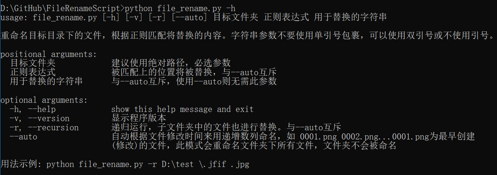

# 简介

脚本最好使用python 3来运行

批量重命名文件，有两种用法：

1. 根据正则匹配位置，替换为同一字符串

    `python file_rename.py -r D:\test \.jfif .jpg` 将.jfif后缀替换为.jpg

2. 根据创建（最后修改）时间递增命名

    这适用于批量图片处理场景，有些软件批量导入图片是根据文件名排序的，我们想导入后根据拍摄时间排序。两者不符时，可以使用此脚本。

# 使用方法

